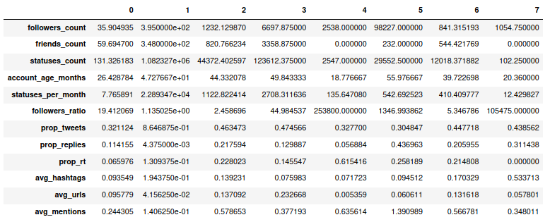
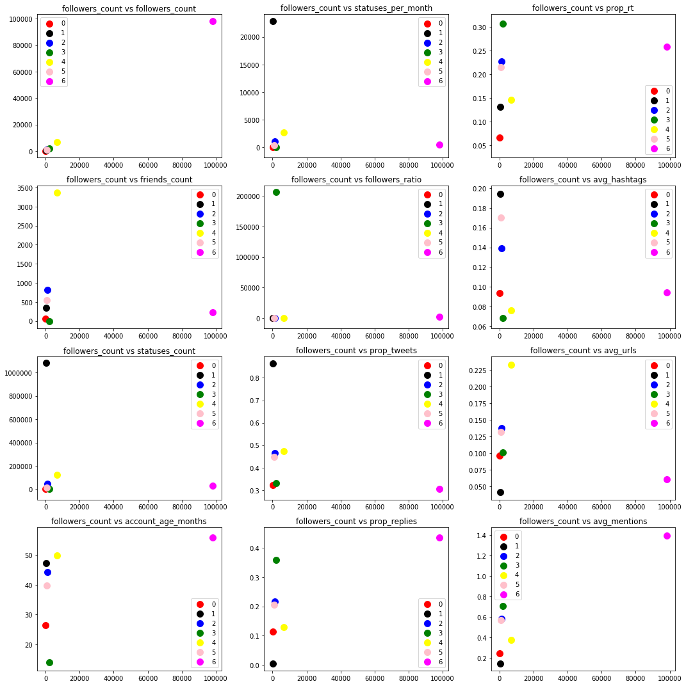

Post data processing, we tried different ways to cluster data i.e k-means and DBSCAN. Here are some visualization and statistics about the discovered clusters.
## Analysis

The clustering gave us the following centroids. The representatives of each labels/clusters have the following properties.

%TODO Comments on what we notice 

### Plot of features distribution

From the features distribution, we can see the different clusters' distribution distinctively in those features, these increase the likeliness that such clusters do exist.
LABELLING of clusters from the features distribution 
%doing interactive

Representing pairwise distance between clusters'features. Relation ...

%Interactive 

